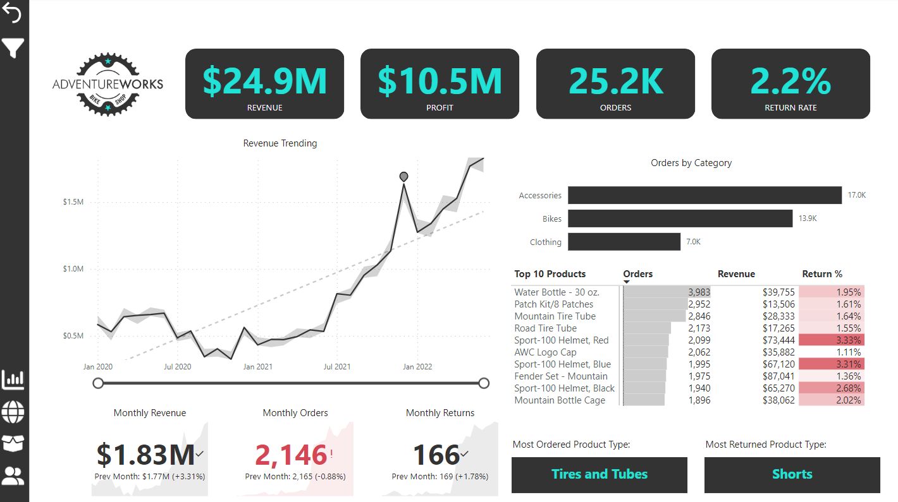
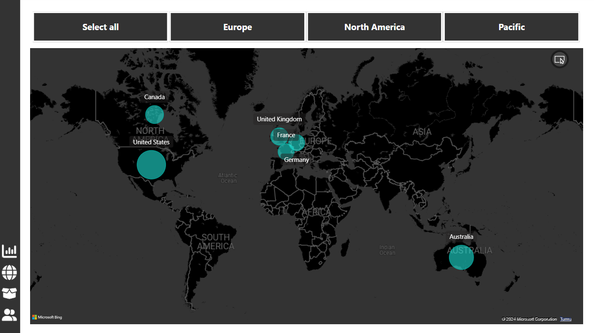
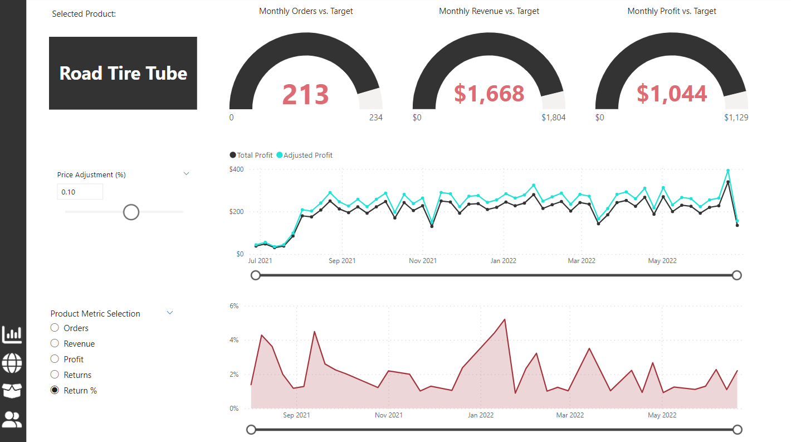
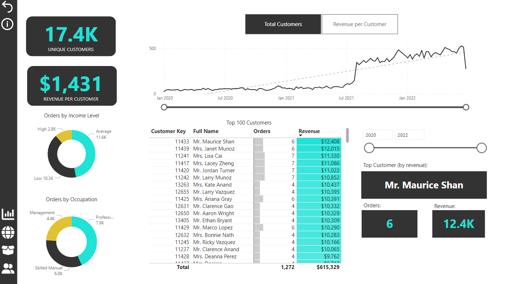
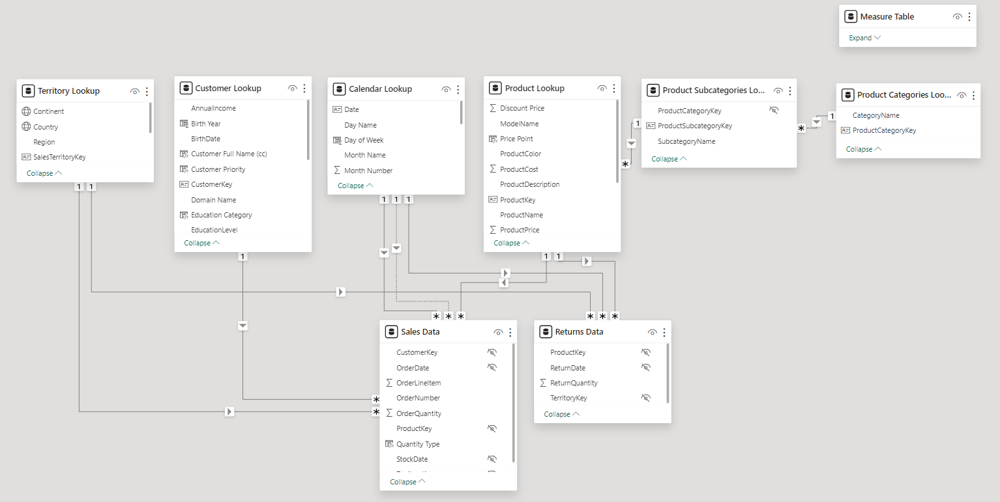

# AdventureWorks Power BI Dashboard Project

## Introduction

This project provides an overview of the application of Power BI Desktop in the realm of business intelligence and data visualization, centering on data from AdventureWorks, a manufacturing entity in the cycling equipment sector. The project's essence is to transform raw sales and operational data into a digestible format, uncovering key trends and insights that drive strategic business decisions.

## Tools and Technologies Utilized

- **Power BI Desktop**: Employed for comprehensive data manipulation, modeling, visualization, and analytical endeavors.
- **DAX (Data Analysis Expressions)**: Leveraged to engineer calculated columns and measures, facilitating a granular examination of the dataset.

## How to Use This Dashboard

This dashboard is designed to be interactive and intuitive:
- Utilize slicers to narrow down data by specific criteria such as time periods, regions, or product categories.
- Hover over any visual for detailed data tooltips.
- Drill into data points for a granular view or drill out for a broader perspective.
- Explore different tabs to uncover various analytical dimensions of the data.

## Dashboard Screenshots
The following screenshots provide a visual tour of the various components of the AdventureWorks Power BI Dashboard. Each screenshot captures different aspects of the dashboard, illustrating the dynamic capabilities and rich data visualizations designed to support strategic business decision-making.

## Key Insights

The project unearthed several pivotal insights:
- A notable escalation in revenue, almost tripling from 2020 to 2022, signifying substantial business growth.
- The "Bikes" category emerged as the cornerstone of revenue and profit generation.
- A predominant volume of orders originating from the United States, highlighting its significance as a key market.
- The identification of premier revenue-generating customers, enabling the formulation of targeted marketing strategies.

## Future Enhancements

Anticipated future work includes integrating predictive analytics for sales forecasting, conducting in-depth customer segmentation for precision marketing, and real-time data feeds for dynamic analysis.

## Data Privacy Note

The raw data utilized in this project, sourced from the "Power BI for Business Intelligence" course, is not publicly shared out of respect for copyright and privacy considerations. The data served as a foundational learning tool, and its dissemination is restricted to preserve the integrity of the course materials and respect the proprietary nature of the data.

For any inquiries, collaboration opportunities, or feedback, please don't hesitate to connect with me on [LinkedIn](https://www.linkedin.com/in/hamidrezarahimi/). Your insights are highly valued and appreciated.
